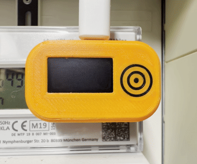
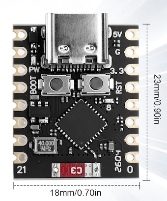
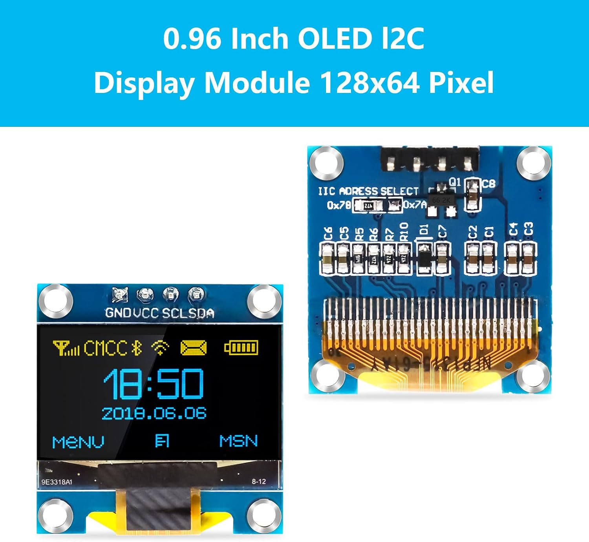
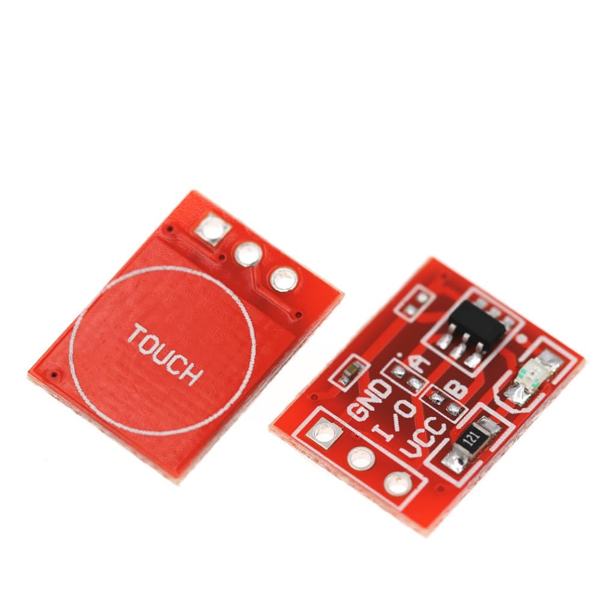
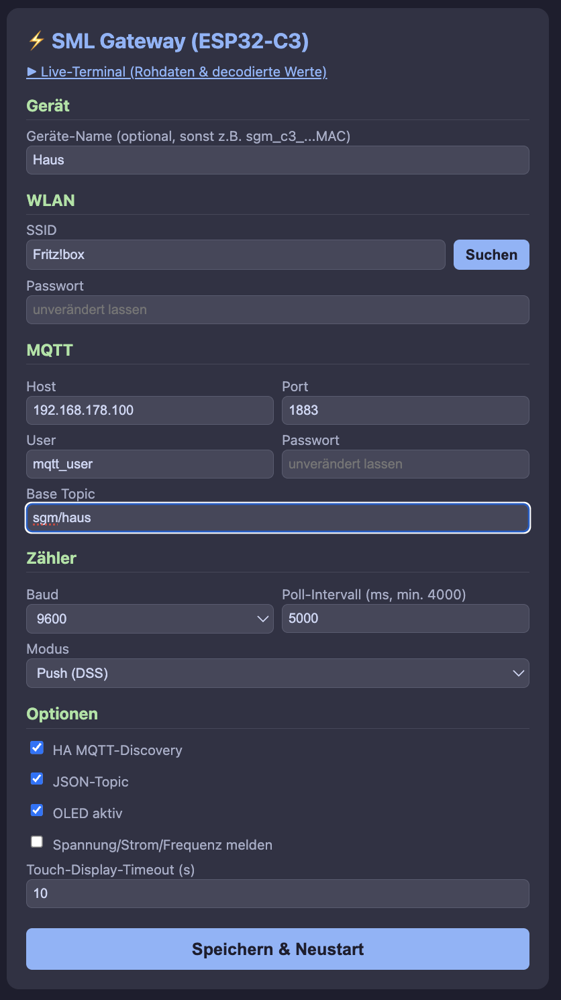

<p align="center">
  
</p>

# DocBigsLab – SML Meter Gateway (ESP32-C3)




Für **SGM-DD** Smart-Grid-Vierleiterzähler und andere Zähler, deren
IR-Schnittstelle die gleiche Bauform hat – der Lesekopf ist mechanisch
genau darauf zugeschnitten. Voraussetzung ist der aktivierte Push-Modus
(der Zähler sendet kontinuierlich das komplette Datenpaket, ohne Anfrage).

**🚀 [Firmware per Web-Installer flashen](https://docbigs-lab.github.io/SML-Meter-Gateway/)** – direkt im Browser, ohne Tools ([Details](#installation)).

> **PIN-Freigabe:** Viele Zähler (u. a. EFR SGM-D/-DD) geben die
> vollständigen Daten erst nach Eingabe der PIN am Gerät frei. Ohne PIN
> kommt oft nur der Zählerstand, aber keine weiteren Daten. 
> Die PIN gibt es beim Messstellenbetreiber.

## Übersicht

| Funktion | Status |
|---|---|
| IEC 62056-21 D0-Polling | ✅ (benötigt TX zum Zähler, s. u.) |
| SML/DSS-Push (Mode D) | ✅ |
| OLED (SSD1315 I²C) | ✅ |
| MQTT (256dpi) | ✅ |
| Home Assistant Auto-Discovery | ✅ |
| Universelle JSON-Topic | ✅ |
| Captive-Portal (AP) | ✅ |
| NVS-Persistenz | ✅ |
| MQTT-Commands (poll, reboot, config) | ✅ |
| Eindeutige Geräte-ID (Multi-Gateway-fähig) | ✅ |
| Boot-/Verbindungs-Log seriell | ✅ |
| Touch-gesteuerte Display-Anzeige | ✅ |

## Verdrahtung (ESP32-C3 DevKitM-1)



| GPIO | Funktion | Verbunden mit |
|---|---|---|
| 3V3 | Versorgung 3.3V | IR-Lesekopf, OLED, Touch-Modul |
| GND | Masse | IR-Lesekopf, OLED, Touch-Modul |
| GPIO4 | UART1_RX (`CFG_CH1_RX`) | IR-Lesekopf TX |
| GPIO7 | UART1_TX (`CFG_CH1_TX`) *(optional)* | IR-Lesekopf RX |
| GPIO6 | I²C SDA (`CFG_I2C_SDA`) | OLED SDA |
| GPIO5 | I²C SCL (`CFG_I2C_SCL`) | OLED SCL |
| GPIO3 | Touch-Eingang (`CFG_TOUCH_PIN`) | Touch-Modul OUT |

```
IR-TTL-Lesekopf → ESP32-C3
  3.3V          → 3V3
  GND           → GND
  RX (Zähler)   → GPIO4   (UART1_RX, CFG_CH1_RX)
  TX (ESP)      → GPIO7   (UART1_TX, CFG_CH1_TX)  [optional, s. u.]

SSD1315 OLED I²C (0.96", oft als "SSD1306" verkauft — Chip-Aufdruck prüfen!)
  GND           → GND
  VCC (3.3V)    → 3V3 (nicht 5V — ESP32-C3-GPIOs sind 3.3V-only)
  SDA           → GPIO6   (CFG_I2C_SDA)
  SCL           → GPIO5   (CFG_I2C_SCL)

Touch-Modul (TTP223 o.ä., digitaler HIGH/LOW-Ausgang)
  GND           → GND
  VCC (3.3V)    → 3V3
  OUT           → GPIO3   (CFG_TOUCH_PIN)
```

<p align="center">
  
  
</p>
<p align="center"><em>Links: OLED-Display 0,96" (I²C, 128×64) · Rechts: Touch-Modul TTP223</em></p>

> **TX zum Zähler ist optional:** Wird nur für den D0-Polling-Modus
> benötigt, um den Zähler mit `/?!\r\n` zur Datenübertragung
> aufzufordern. Im SML/DSS-Push-Modus (Mode D) sendet der Zähler von
> sich aus, ohne Anfrage nötig. Für dieses Gerät wird kein Schreiben
> auf den Zähler benötigt.

> **Lesekopf:** Schaltung, Funktionsweise und Platine des verwendeten
> Lesekopfs sind in [docs/lesekopf.md](docs/lesekopf.md) beschrieben, das
> 3D-gedruckte Gehäuse in [docs/gehaeuse.md](docs/gehaeuse.md).

> **OLED-Adresse:** Der Code prüft fest I2C-Adresse `0x3C` (Standard bei
> den meisten Modulen). Manche sind auf `0x3D` gestrappt — im Log erscheint
> dann `[OLED] Kein Display an I2C 0x3C gefunden`.

> **Touch/Display-Verhalten:** Der ESP32-**C3** hat keine eigene
> Touch-Sensor-Hardware (anders als klassischer ESP32/S2/S3) — deshalb ein
> externes TTP223-Modul statt `touchRead()`. Das OLED läuft im
> Normalbetrieb standardmäßig im Stromsparmodus (aus). Direkt nach dem
> Boot bleibt es großzügige 60s an, damit Status-Meldungen lesbar sind.
> Danach: Touch weckt es auf und zeigt den ersten Wert (Leistung) groß;
> weiterer Touch schaltet durch (Leistung → Bezug → Einspeisung →
> Spannung → Strom → Frequenz → von vorn). Der angezeigte Wert wird nur
> beim Touch aktualisiert, nicht laufend (kein Flackern). Ohne erneuten
> Touch geht es nach "Touch-Display-Timeout" (im Portal einstellbar,
> Default 10s) wieder aus.

> Die Pins sind Defaults aus `main.cpp` und lassen sich per `build_flags` in
> `platformio.ini` überschreiben (z. B. `-DCFG_CH1_RX=n`).

## Installation

### 🚀 Web-Installer (empfohlen)

Firmware direkt im Browser flashen – kein Tool, keine Kommandozeile:

👉 **[Web-Installer starten](https://docbigs-lab.github.io/SML-Meter-Gateway/)**

1. ESP32-C3 per USB anschließen.
2. Seite in **Chrome oder Edge** öffnen (Firefox und Safari können kein
   Web Serial) und auf „Firmware jetzt flashen" klicken.
3. Port auswählen, Installation bestätigen – danach geht es mit der
   [Ersten Inbetriebnahme](#erste-inbetriebnahme) weiter.

> Bei der Erstinstallation fragt der Installer, ob der Flash gelöscht
> werden soll – für ein neues Gerät ja. Bei einem **Update** nein: dann
> bleiben WLAN- und MQTT-Einstellungen erhalten.
>
> Wird kein Port angezeigt oder bricht die Verbindung ab: BOOT-Taster
> gedrückt halten, kurz RESET drücken, BOOT loslassen und erneut
> versuchen.

### Selbst bauen (PlatformIO)

```bash
pio run -t upload
pio device monitor
```

Jeder Build legt über `build_installer.py` die Flash-Teile unter
`docs/firmware/` ab und aktualisiert `docs/manifest.json` mit der Version
aus `FW_VERSION` – der Web-Installer liefert also immer den zuletzt
committeten Build aus.

> **ESP32-C3 nativer USB-Port:** `upload_speed = 115200` ist in
> `platformio.ini` bewusst gesetzt. Mit der esptool-Default-Baudrate bricht
> der Flash-Vorgang über den nativen USB-CDC-Port auf diesem Board oft
> reproduzierbar ab („chip stopped responding"). Bei Upload-Problemen:
> anderes/kürzeres USB-Kabel, direkt in einen Mac/PC-Port (kein Hub), und
> beim Verbindungsaufbau ggf. den BOOT-Taster gedrückt halten.

## Erste Inbetriebnahme

1. Gerät ohne gespeichertes WLAN (Default-SSID `changeme`) → startet AP
   `SGM-Setup-C3` (PW `sgm12345`).
2. Im Browser: `http://192.168.4.1` (öffnet sich auf den meisten Geräten
   automatisch als Captive-Portal-Hinweis).
   
3. Im Formular: WLAN (per „Suchen" lassen sich Netze in Reichweite samt
   Signalstärke auflisten und per Klick übernehmen — praktisch, um die
   Empfangsqualität am Einbauort zu prüfen; unter ca. −75 dBm wird es
   wackelig), MQTT-Broker, Base-Topic, Baudrate, Poll-Intervall
   (min. 4000 ms — kürzere Werte haben keine Wirkung, da ein Frame-Read
   intern bis zu 4 s dauert), Modus, HA-Discovery, OLED. WLAN-/MQTT-Passwort
   werden aus Sicherheitsgründen nie vorausgefüllt — leer lassen heißt
   „unverändert".
4. Speichern → Gerät startet neu, verbindet sich und pusht.

### Einstellungen nachträglich ändern

Das Web-Portal läuft auch im normalen Betrieb und ist jederzeit unter der
IP des Gateways erreichbar (`http://<IP>/`). Die IP steht im Serial-Log
beim Boot, in der Router-Übersicht (Hostname `sgm-gateway-c3`) und ist
in Home Assistant auf der Geräteseite mit dem „Besuchen-Button" direkt 
aufrufbar.

Kommt das Gerät nicht ins WLAN (falsche Zugangsdaten, Router getauscht),
startet es nach 15 s Verbindungsversuch automatisch das AP-Portal
`SGM-Setup-C3` – dann wie bei der Ersteinrichtung vorgehen. Ist der
MQTT-Broker 5 Minuten lang nicht erreichbar, passiert dasselbe.

Verbindet sich 3 Minuten lang niemand mit dem Portal, startet das Gerät
neu und versucht das gespeicherte WLAN erneut. So findet es nach einem
Stromausfall (Router bootet langsamer als der ESP) oder einem
Broker-Neustart von selbst zurück in den Normalbetrieb. Ist noch kein
WLAN konfiguriert, bleibt das Portal dauerhaft offen.

**Notlösung, falls die IP unbekannt ist:** per MQTT

```
Topic:   smarthome/sgm/cmd/config
Payload: beliebig (z. B. "1")
```

veröffentlichen. Das Gerät startet neu und geht ins AP-Portal, auch wenn
die WLAN-Verbindung funktionieren würde.

## Serial-Diagnose (115200 Baud)

Beim Boot wird der Verbindungsstatus mitgeloggt:

```
[BOOT] ESP32-C3 startet...
[CFG] Geraete-ID=sgm_c3_xxxxxxxxxxxx SSID='...' MQTT=host:port Topic='...'
[WIFI] Verbinde mit SSID '...' ...
[WIFI] verbunden, IP=192.168.x.x
[MQTT] Verbinde zu host:port ...
[MQTT] verbunden als 'sgm_c3_xxxxxxxxxxxx'
```

Schlägt WLAN fehl, erscheint stattdessen `[WIFI] Verbindung fehlgeschlagen
(status=...)` gefolgt von `[AP] Captive-Portal gestartet: ...`. Schlägt MQTT
fehl: `[MQTT] Verbindung fehlgeschlagen (error=..., returnCode=...)` (Codes
aus der `lwmqtt`-Bibliothek, z. B. Broker nicht erreichbar oder
Zugangsdaten falsch).

## MQTT-Topics

Basistopic `smarthome/sgm` (konfigurierbar):

| Topic | Inhalt |
|---|---|
| `smarthome/sgm/status` | online/offline (retained, LWT) |
| `smarthome/sgm/power_w` | Leistung [W] |
| `smarthome/sgm/import_kwh` | Import [kWh] |
| `smarthome/sgm/export_kwh` | Export [kWh] |
| `smarthome/sgm/total_kwh` | Gesamt [kWh] |
| `smarthome/sgm/voltage_v` | Spannung [V] |
| `smarthome/sgm/current_a` | Strom [A] |
| `smarthome/sgm/json` | Vollständiges JSON-Paket |

### Commands (veröffentlichen auf)

| Topic | Wirkung |
|---|---|
| `smarthome/sgm/cmd/poll` | Sofortiges Polling |
| `smarthome/sgm/cmd/reboot` | Neustart |
| `smarthome/sgm/cmd/config` | Neustart, erzwingt beim nächsten Boot das AP-Config-Portal (`SGM-Setup-C3`), unabhängig vom WLAN-Status — Notlösung, falls die IP des Web-Portals unbekannt ist |

## Home Assistant

Mit aktivierter HA-Discovery erscheinen die Sensoren automatisch, benannt
nach der geräteeigenen, aus der Efuse-MAC abgeleiteten ID (`sgm_c3_xxxx…`,
siehe Serial-Log beim Boot) — dadurch kollidieren mehrere Gateways am
selben MQTT-Broker nicht miteinander. Auf der Geräteseite in HA stehen
Hersteller, Modell (`SML Meter Gateway (ESP32-C3)`) und Firmware-Version
(`FW_VERSION`, per `build_flags` überschreibbar), dazu ein Link „Besuchen"
direkt zum Web-Portal des Gateways. Folgende Sensoren werden angelegt:
- Power (W)
- Import, Export, Gesamt (kWh) — mit `state_class: total_increasing`,
  landet automatisch im HA-Energie-Dashboard
- Spannung (V), Strom (A)

Alternativ manuell in `configuration.yaml`:
```yaml
mqtt:
  sensor:
    - name: SGM Power
      state_topic: "smarthome/sgm/power_w"
      unit_of_measurement: "W"
      device_class: power
    - name: SGM Import
      state_topic: "smarthome/sgm/import_kwh"
      unit_of_measurement: "kWh"
      device_class: energy
      state_class: total_increasing
```

## OBIS-Referenz

| OBIS | Bedeutung |
|---|---|
| `1-0:7.7.0` | Aktive Leistung |
| `0-0:1.8.0` | Gesamtenergie |
| `0-0:1.8.1` | Import |
| `0-0:1.8.2` | Export |
| `1-0:24.7.0` | Spannung |
| `1-0:31.7.0` | Strom |
| `0-0:32.0.0` | Netzfrequenz |

> ⚠️ Die OBIS-Codes für Spannung (`1-0:24.7.0`) und Netzfrequenz
> (`0-0:32.0.0`) weichen von den in der Praxis gebräuchlichen
> Standard-OBIS-Kennzahlen ab (üblich wären eher `1-0:32.7.0` bzw.
> `1-0:14.7.0`). Kann herstellerspezifisch beim SGM-D/DigiMeto korrekt
> sein — bitte gegen echte Serial-Logs vom eigenen Zähler verifizieren,
> bevor man sich auf diese beiden Werte verlässt.

## Projektstruktur

```
sml-meter-gateway/
├── platformio.ini       # Build-Config, Pins, lib_deps, upload_speed
├── build_installer.py   # Post-Build: Flash-Teile + manifest.json für den Web-Installer
├── README.md
├── LICENSE              # MIT
├── docs/
│   ├── index.html        # Web-Installer (GitHub Pages, ESP Web Tools)
│   ├── manifest.json     # Installer-Manifest (automatisch erzeugt)
│   ├── firmware/         # Flash-Teile für den Installer (automatisch erzeugt)
│   ├── stls/             # STL-Dateien für das 3D-gedruckte Gehäuse
│   ├── lesekopf.md       # Schaltung und Aufbau des IR-Lesekopfs
│   ├── gehaeuse.md       # 3D-gedrucktes Gehäuse
│   └── assets/           # Bilder (Installer-Seite, Lesekopf, Gehäuse)
└── src/
    └── main.cpp          # Komplette Firmware (einzige Source-Datei)
```
