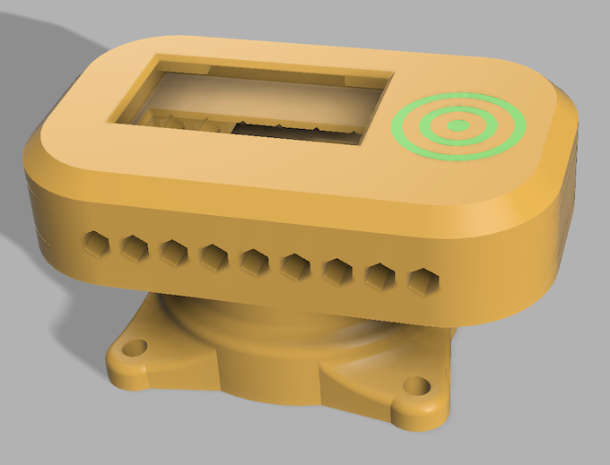
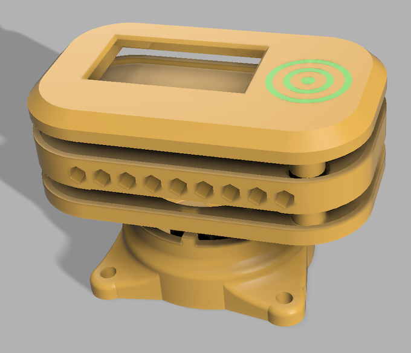
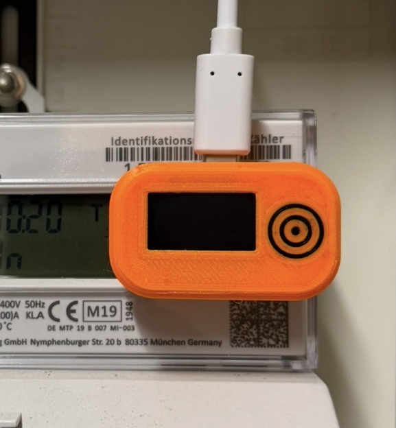

# Gehäuse

*Gehäuse*

Das Gehäuse wurde in Fusion konstruiert. Es besteht aus vier Einzelteilen, die sich einfach per 3D-Druck herstellen lassen:

- oberer Deckel
- Mittelteil
- unterer Deckel
- Sockel

*Einzelteile des Gehäuses*

## Hinweise zum Druck

- Einige Teile brauchen teilweise Stützstrukturen.
- Beim Sockel muss an entsprechender Stelle eine Druckpause gesetzt werden, um den Ringmagneten (Außen-Ø 27 mm, Innen-Ø 16 mm, Höhe 5 mm) zur Befestigung einzulegen. Bei welcher Schicht die Pause liegt, hängt von der im Slicer eingestellten Schichthöhe ab.
- Der Sockel wird anschließend mit Sekundenkleber mit dem unteren Deckel verklebt.

## STL-Dateien
tedfy1-porqaR-morwam
| Teil | Datei |
|---|---|
| oberer Deckel | [Deckel-oben.stl](stls/Deckel-oben.stl) |
| Mittelteil | [Mittelteil.stl](stls/Mittelteil.stl) |
| unterer Deckel | [Deckel-unten.stl](stls/Deckel-unten.stl) |
| Sockel | [Sockel.stl](stls/Sockel.stl) |

*Fertiges Gerät im Einsatz am Zähler*
