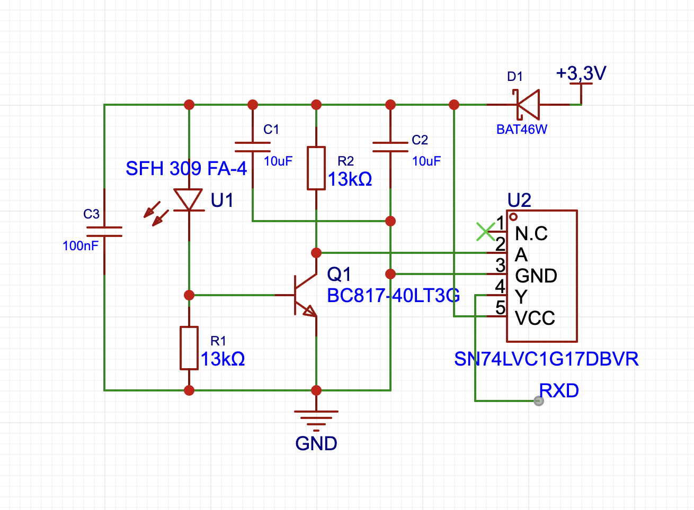
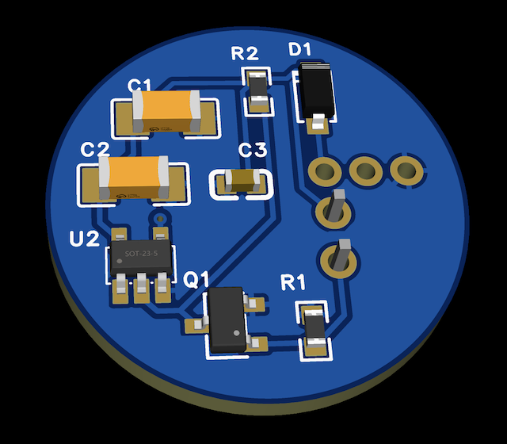

# Lesekopf für Stromzähler – Schaltungsbeschreibung

Ein zweistufiger IR-Empfänger zur optischen Auslesung der D0-/SML-Schnittstelle (OBIS-Daten) von Stromzählern, abgeleitet vom Volkszähler-Referenzdesign.

*Schaltplan (Fototransistor, Verstärkerstufe, Schmitt-Trigger)*

---

## 1. Funktionsprinzip

Der Signalweg gliedert sich in drei Stufen:

### 1.1 Fotoempfänger (U1, R1, C3)

Der **SFH309FA-4** ist ein NPN-Fototransistor mit Tageslichtsperrfilter. Er arbeitet mit **R1 (13 kΩ)** als Lastwiderstand: Trifft ein IR-Impuls der Zähler-LED auf, fließt ein Fotostrom, der über R1 einen Spannungsabfall erzeugt. Der Tageslichtsperrfilter hält dabei sichtbares Umgebungslicht weitgehend fern.

### 1.2 Verstärker-/Schaltstufe (Q1, R2)

Der **BC817-40** arbeitet als invertierender Verstärker in Emitterschaltung mit **R2 (13 kΩ)** als Kollektorwiderstand. Aufgaben dieser Stufe:

- Verstärkung des kleinen, trägen Spannungshubs des Fototransistors auf einen großen, fast rail-to-rail Hub
- Durch die Verstärkung schaltet der Transistor schnell zwischen Sättigung und Sperrung – das macht die Flanke am Kollektor deutlich steiler als am reinen Fototransistor-Ausgang

### 1.3 Signalaufbereitung (U2 – SN74LVC1G17)

Ein **Schmitt-Trigger-Buffer**, der aus der noch nicht perfekten Flanke von Q1 einen sauberen digitalen Pegel mit definierter Schalt-Hysterese formt und direkt den **RXD**-Eingang des Mikrocontrollers treibt.

Zusätzlich:
- **D1 (BAT46W)** – Schottky-Diode zur Entkopplung/Schutz der 3,3-V-Versorgung
- **C3 (100 nF)** – Entkopplung der Versorgung: fängt schnelle Spannungsspitzen ab, direkt zwischen Versorgung und GND
- **C1, C2 (10 µF)** – Pufferung der Versorgung gegen langsamere Einbrüche, z. B. beim Umschalten von Q1 und U2

---

## 2. Warum reicht ein einfacher Fototransistor an einem GPIO nicht?

Die Lösung "einfacher Fototransistor direkt an einen GPIO" ist in der Community sehr verbreitet, weil sie auf den ersten Blick einfach und günstig wirkt. In der Praxis macht sie aber sehr schnell Probleme und stellt keine zufriedenstellende Lösung dar, sobald es um die zuverlässige Auslesung der OBIS-Daten geht.

Bei der Auslesung der optischen Schnittstelle wird nicht nur gezählt, sondern eine **serielle Bitfolge** übertragen – nach DIN EN 62056-21 (D0-Schnittstelle) mit 300–9600 Baud, bzw. bei modernen Zählern direkt als **SML-Telegramm** mit den OBIS-Kennzahlen.

Ein UART-Empfänger tastet das Signal in der Mitte jedes festen Bit-Zeitfensters ab (bei 9600 Baud ca. alle 104 µs). Das stellt hohe Anforderungen an Flankensteilheit und Signalqualität:

| Problem am nackten Fototransistor | Auswirkung bei UART/OBIS |
|---|---|
| Träge, lineare Flanke (parasitäre Sperrschichtkapazität, kleiner Fotostrom) | Startbit-Erkennung verspätet sich → gesamtes Abtastraster verschiebt sich |
| Spannungshub abhängig von Lichtintensität/Abstand/Alterung | Keine stabile, definierte Schaltschwelle |
| Kein Hysterese-Mechanismus | Rauschen/Fremdlicht führt zu Mehrfach-Kippen nahe der Schwelle |
| Zu langsame An-/Abstiegszeit bei schnellen Bitwechseln (`...1010101...`) | "Augenöffnung" schließt sich → Bitfehler statt nur Zählfehler |

Ein einzelnes falsch erkanntes Bit zerstört das komplette SML-Telegramm (CRC-Fehler) oder liefert falsche ASCII-Zeichen bei D0 – die OBIS-Werte sind dann unbrauchbar.

---

## 3. Warum die Schaltung das löst

- **Q1 (Verstärkerstufe):** schaltet unabhängig vom exakten Fotostrom-Pegel schnell und mit vollem Hub durch – wichtig für stabiles Bit-Timing auch bei hohen Baudraten
- **Schmitt-Trigger (74LVC1G17):** liefert Hysterese gegen Rauschen und eine konsistente Schaltschwelle mit minimaler, definierter Verzögerung – verhindert Bit-Timing-Jitter
- **Tageslichtsperrfilter (SFH309FA-4):** hält sichtbares Fremdlicht vom Sensor fern, bevor es überhaupt zu einem Störsignal wird
- **C3, C1, C2:** halten die Versorgung stabil, damit Spannungseinbrüche und -spitzen nicht als Phantom-Flanken mitten im Bitstream Störbits erzeugen

**Fazit:** Bei OBIS-Auslesung über die optische Schnittstelle ist diese Signalaufbereitung keine Komfortfunktion, sondern die Voraussetzung dafür, dass die UART überhaupt fehlerfreie Telegramme empfängt. Ein nackter Fototransistor an einem GPIO liefert bei den nötigen Baudraten keine verlässliche Bit-für-Bit-Dekodierung.

---

## 4. Platine

**Lesekopf:** Es wurde eine maßgefertigte Platine in SMD Technik passend für den Lesekopf designt und gefertigt.

---

## 5. Kompletter Lesekopf

*Fertig montierter Lesekopf mit Magnethalterung am Stromzähler*
